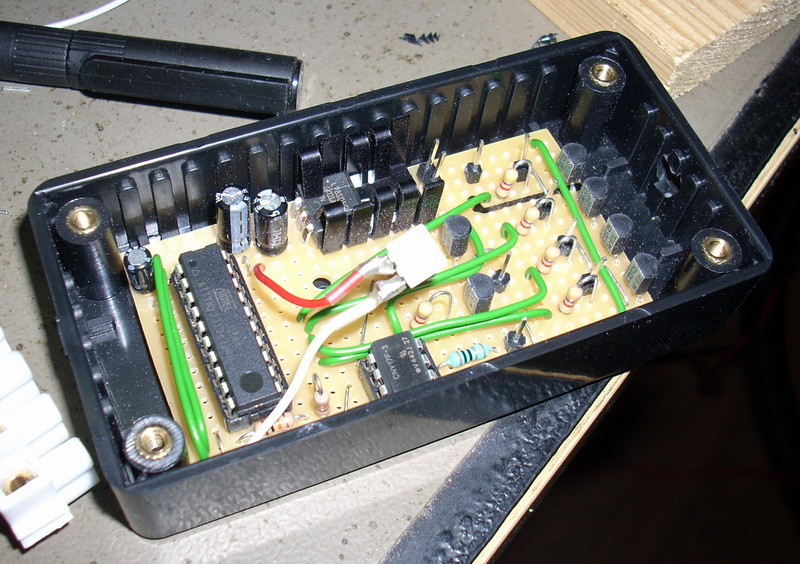

## Source code for project: [Warning strobe light controller for car](https://link.stdout.no/b)

Strobe light controller, using the AVR ATtiny2313 microcontroller. Meant for cars; with front, side and rear warning lights.

Written in basic, using [Bascom-AVR](http://www.mcselec.com/).

### Author
[Thomas Jensen](https://thomas.stdout.no)
